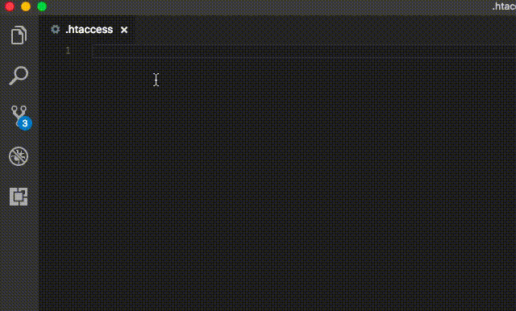

# Apache Conf Snippets for VS Code

This extension for Visual Studio Code adds snippets for Apache Conf (.htaccess file).

## Usage

Type part of a snippet, press `enter`, and the snippet unfolds.

## Installation

1. Install Visual Studio Code 1.10.0 or higher
1. Launch Code
1. From the command palette `Ctrl`-`Shift`-`P` (Windows, Linux) or `Cmd`-`Shift`-`P` (OSX)
1. Select `Install Extension`
1. Choose the extension
1. Reload Visual Studio Code